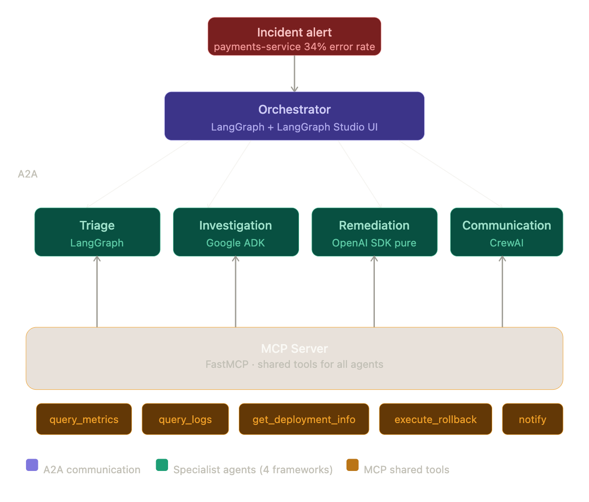

# how-agents-talk

> A practical demonstration of **Agent-to-Agent (A2A)** and **Model Context Protocol (MCP)** working together to resolve a production incident — implemented across four different AI frameworks.



---

## What this is

A **payments-service** fires a 34% error rate alert. An orchestrator receives it and delegates to four specialist agents — each built with a different framework — all communicating via A2A and sharing tools via MCP.

| Variant | Approach | LLM | Status |
|---|---|---|---|
| `a2a/` | Cross-framework via A2A SDK | OpenAI / Anthropic / Gemini | 🚧 In progress |
| `beeai/` | BeeAI + Ollama | Local (Granite, Llama, etc.) | 📋 Planned |

---

## Architecture

```
Incident alert: payments-service 34% error rate
        │
        ▼
┌─────────────────────────────────┐
│  Orchestrator  (LangGraph)      │  ← receives alert, delegates via A2A
└──────┬──────┬──────┬────────────┘
       │ A2A  │ A2A  │ A2A   │ A2A
       ▼      ▼      ▼       ▼
  Triage  Invest.  Remedi.  Comms
 LangGraph  ADK   OpenAI   CrewAI
       │      │      │       │
       └──────┴──────┴───────┘
                  │
                  ▼
       ┌──────────────────────┐
       │      MCP Server      │  ← FastMCP · shared tools for all agents
       │  (FastMCP + ports    │
       │   & adapters)        │
       └──────────────────────┘
    query_metrics · query_logs
    get_deployment_info · execute_rollback · notify
```

**A2A** is the communication bus between agents — each agent exposes an `agent_card.json` describing its capabilities, and agents discover each other dynamically.

**MCP** is the shared tooling layer — any MCP-compatible agent calls `query_metrics`, `query_logs`, etc. without knowing the underlying data source.

---

## Project Structure

```
how-agents-talk/
│
├── a2a/                            # cross-framework via A2A SDK
│   ├── mcp-server/                 # FastMCP — shared tools backend
│   │   ├── server.py
│   │   ├── deps.py                 # composition root — swaps adapters via env vars
│   │   ├── ports/                  # Python Protocol contracts
│   │   │   ├── metrics.py
│   │   │   ├── logs.py
│   │   │   ├── deployments.py
│   │   │   └── notifications.py
│   │   └── adapters/
│   │       └── mock/               # default — no credentials needed
│   │           ├── metrics.py
│   │           ├── logs.py
│   │           ├── deployments.py
│   │           └── notifications.py
│   ├── problem/                    # shared scenario: contracts + mock data
│   │   ├── contracts/
│   │   │   └── models.py           # Pydantic models (Alert, TriageResult, …)
│   │   └── mocks/
│   │       └── data.py             # in-memory mock state
│   ├── triage-agent/               # LangGraph + a2a-sdk
│   ├── investigation-agent/        # Google ADK (native A2A)
│   ├── remediation-agent/          # OpenAI SDK + a2a-sdk
│   ├── communication-agent/        # CrewAI + a2a-sdk
│   └── orchestrator/               # LangGraph + LangGraph Studio
│
└── beeai/                          # 📋 planned — BeeAI + Ollama local
```

---

## Quickstart

### Run with mocks (no credentials)

```bash
# 1. Start the MCP server
cd a2a/mcp-server
uv sync
fastmcp run server.py --transport http --port 8000

# 2. Start the Triage Agent
cd a2a/triage-agent
uv sync
OPENAI_API_KEY=... uv run python server.py
```

### Run with real integrations

```bash
METRICS_ADAPTER=datadog \
LOGS_ADAPTER=datadog \
NOTIFICATIONS_ADAPTER=pagerduty \
DD_API_KEY=... DD_APP_KEY=... \
PD_API_KEY=... PD_SERVICE_ID=... \
fastmcp run a2a/mcp-server/server.py --transport http --port 8000
```

### Observability (LangSmith + Lang Studio)

```bash
# 1. Copy .env.example and fill in your keys
cp .env.example .env

# 2. Edit .env with:
#    OPENAI_API_KEY=sk-...
#    LANGSMITH_API_KEY=ls-...
#    LANGSMITH_PROJECT=how-agents-talk
#    LANGSMITH_TRACING=true

# 3. Start with env vars loaded
set -a && source .env && set +a
uv run python a2a/triage-agent/server.py
```

With `LANGSMITH_TRACING=true`, every agent invocation is traced in
[LangSmith](https://smith.langchain.com). Use **Lang Studio** (`langgraph dev`)
for interactive graph debugging — requires the LangGraph CLI (install via `pip install langgraph-cli`).

---

## MCP Tools

| Tool | Description |
|---|---|
| `query_metrics` | Current operational metrics for a service |
| `get_error_rate` | Error rate + health status (healthy / degraded / critical) |
| `query_logs` | Recent log entries filtered by level (ERROR / WARN / INFO / ALL) |
| `get_deployment_info` | Deployment details including applied migrations |
| `execute_rollback` | Roll back a deployment to the previous stable version |
| `notify_team` | Send incident notification (`team` channel or `escalation` for critical) |
| `create_incident_report` | Structured post-incident report |

---

## Ports & Adapters

The MCP server uses the [hexagonal architecture](https://alistair.cockburn.us/hexagonal-architecture/) pattern. Ports are Python `Protocol` contracts; adapters are swapped at startup via env vars — `server.py` never changes.

```
METRICS_ADAPTER=mock      → a2a/mcp-server/adapters/mock/metrics.py       (default)
METRICS_ADAPTER=datadog   → a2a/mcp-server/adapters/datadog/metrics.py    (needs DD_API_KEY)

NOTIFICATIONS_ADAPTER=mock      → a2a/mcp-server/adapters/mock/notifications.py
NOTIFICATIONS_ADAPTER=pagerduty → a2a/mcp-server/adapters/pagerduty/notifications.py
```

---

## How each framework implements A2A
 
A2A is an open protocol — any framework can implement it. This repo shows five different integration approaches side by side:
 
| Framework | A2A pattern | Boilerplate |
|---|---|---|
| **LangGraph + a2a-sdk** | Manual `AgentExecutor` + `A2AStarletteApplication` | High — protocol visible in code |
| **OpenAI SDK + a2a-sdk** | Same pattern as LangGraph | High |
| **CrewAI + a2a-sdk** | Same pattern as LangGraph | High |
| **Google ADK** | `to_a2a(agent)` — one line, AgentCard auto-generated | Low |
| **BeeAI** | `A2AServer(...).register(agent).run()` — framework abstracts everything | Low |
| **LangGraph + LangSmith** | Deploy via `langgraph dev` or LangSmith Platform — A2A at `/a2a/{assistant_id}`, AgentCard automatic | Zero (platform-managed) |
 
The `a2a/` variant deliberately uses the low-level `a2a-sdk` for LangGraph, OpenAI SDK, and CrewAI — keeping the protocol visible for learning. The `beeai/` variant shows the high-abstraction end of the spectrum.

---

## Frameworks Used

| Agent | Framework | Why | Status |
|---|---|---|---|
| Orchestrator | LangGraph | Graph-based flow + Studio UI for visualization | 📋 Planned |
| Triage | LangGraph | State machine for severity classification | 📋 Planned |
| Investigation | Google ADK | Tool-use + structured reasoning | 📋 Planned |
| Remediation | OpenAI SDK | Direct tool calls, minimal abstraction | 📋 Planned |
| Communication | CrewAI | Role-based crew for report generation | 📋 Planned |
| BeeAI variant | BeeAI + Ollama | Local inference, no API costs | 📋 Planned |

---

## References

- [A2A Protocol](https://a2a-protocol.org/latest/)
- [Model Context Protocol](https://modelcontextprotocol.io/)
- [FastMCP](https://gofastmcp.com)
- [a2a-sdk Python](https://github.com/a2aproject/a2a-python)
- [Architecting Agentic MLOps — A2A + MCP](https://www.infoq.com/articles/architecting-agentic-mlops-a2a-mcp/) — InfoQ, Feb 2026
 